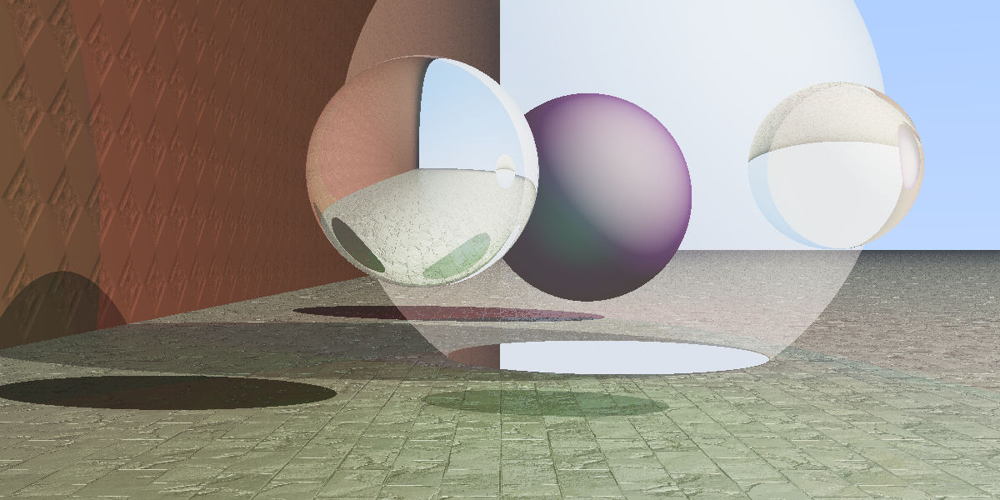
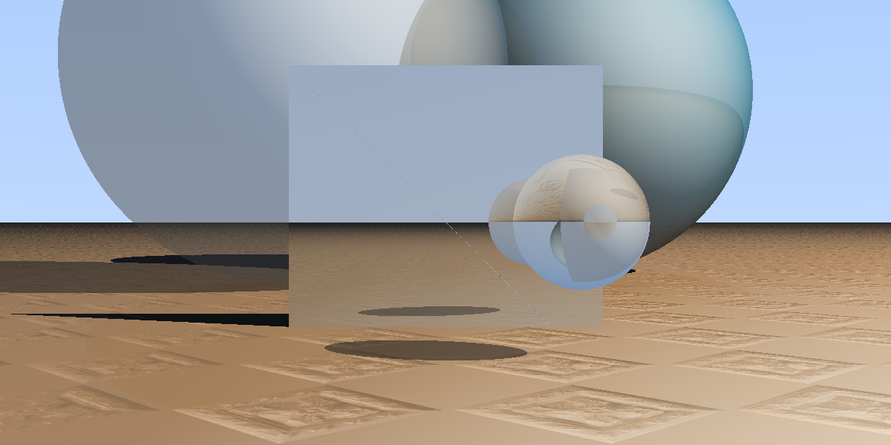
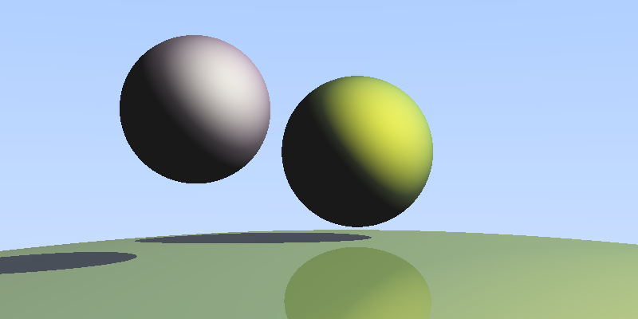
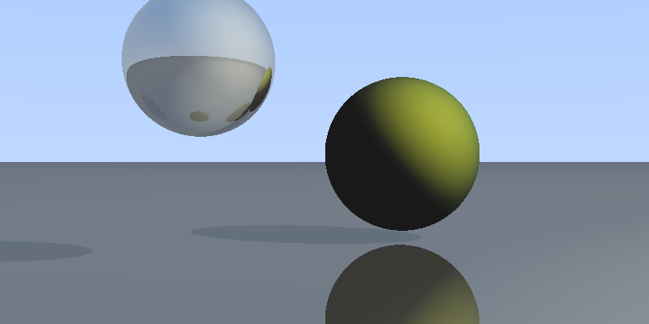
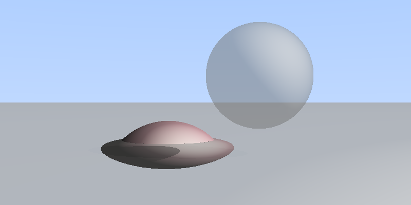
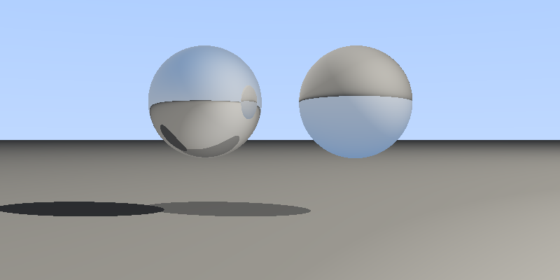
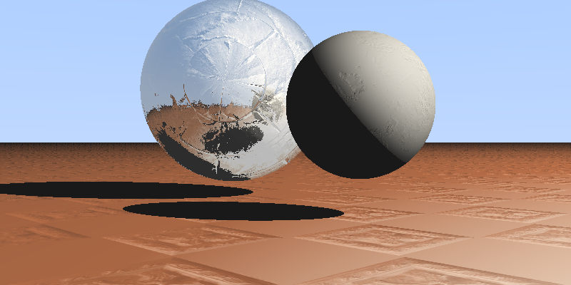
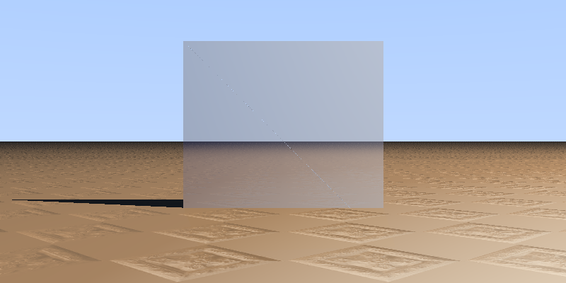
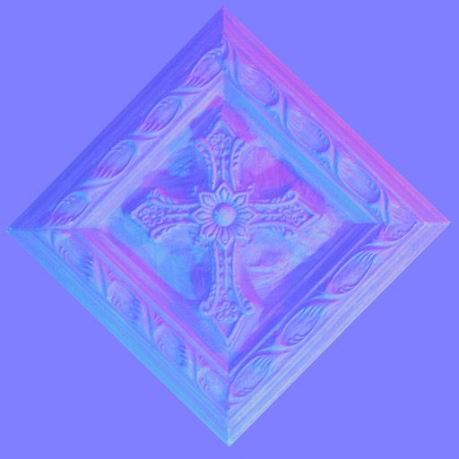

# Raytracing Project

<div style = "text-align:center">
    
    <br />
    <em>header.json</em>
    
    <br />
    <em>niceOne.json</em>
</div>

---
## Table of Contents
- [Raytracing Project](#raytracing-project)
  - [Table of Contents](#table-of-contents)
  - [Showcase of the program](#showcase-of-the-program)
  - [How to render your own scene](#how-to-render-your-own-scene)
    - [Running automatic tests](#running-automatic-tests)

---

## Showcase of the program
Our raytracing program is designed to render complex scenes with high efficiency and detail. Here are some of the key features: \
\
**Object Rendering**: The program can render both spheres and planes (halfspaces) with precision. \
**Color Properties**: Objects can be assigned various color properties, including ambient, diffuse, and specular colors. \
**Reflective and Refractive Surfaces**: Objects can be made reflective or refractive. For refractive objects, a refraction index can be specified to control how light bends as it passes through. \
**Multithreading**: To enhance performance, the program utilizes multithreading, significantly speeding up the rendering process. \
**Sky Color Rendering**: If a ray does not intersect any object, the program renders a sky color based on the angle of the ray. \
**Normal Mapping**: Normal maps can be applied to both spheres and planes, allowing for the rendering of intricate surface details. \
**Triangles**: The program can render triangles, enabling the creation of more complex shapes. (textures are currently disabled) \

**Some Examples**:

<table>
<tr>
    <td>
        
        <br />
        <em>spheres.json</em>
    </td>
    <td>
        
        <br />
        <em>reflection.json</em>
    </td>
    <td>
        
        <br />
        <em>refracted.json</em>
    </td>
</tr>
<tr>
    <td>
        
        <br />
        <em>reflection_vs_refraction.json</em>
    </td>
    <td>
        
        <br />
        <em>textures.json</em>
    </td>
    <td>
        
        <br />
        <em>square.json</em>
    </td>
</tr>
</table>

---

## How to render your own scene 
Ready to create your own stunning visual masterpiece? Make sure you’ve correctly built the program by following the [installation guide](markdown/installation.md).

Scene Basics
Each scene starts with a screen. You’ll need to specify the observer's position, the screen's location, its dimensions, and the pixel density.

Then, we define the medium (aka, the atmosphere of your scene). This involves setting the ambient light, the medium's refractive index, and the recursion depth (how deep the rabbit hole goes when calculating reflections).

Defining Light Sources
Light sources bring your scene to life! Each source needs a position and intensity. Want colored lights? No problem—just define the intensity for each color channel and you're set.

Adding Objects
Objects are where things get interesting. Each object requires a position, a refraction index, and a color (broken down into its component values). If you’re working with spheres, you’ll also need to set the radius, while Halfspace require a normal vector.

Transforming Objects
Feel free to combine these transformations (rotation, transformation and scaling) by nesting them around the object. And yes, they stack.

Merging Objects
To combine objects into a single entity, use the union operator. This allows you to create complex shapes by merging multiple objects together. (union, intersection, exclusion) 

If you need more inspiration you can have a look into markdown/assets/jsons for more examples.
```json
{
    "screen": {
        "dpi": 200,
        "dimensions": [2, 4],
        "position": [-1, -2, -10],
        "observer": [0, 0, -15]
    },

    "medium": {
        "ambient": [0.1, 0.1, 0.1],
        "index": 1,
        "recursion": 1
    },

    "sources": [
        {
            "position": [50, 50, -10],
            "intensity": [0.82, 0.97, 0.98]
        }
    ],

    "objects": [
        {
            "scaling":{
                "factors": [1.0,1.0,1.0],
                "subject": {
                    "translation":{
                        "factors":[0.0, 0.0, 0.0],
                        "subject":{
                            "halfSpace": {
                                "position": [-2, 0, 0],
                                "normal": [1,0,0],
                                "color": {
                                    "ambient": [1, 1, 1],
                                    "diffuse": [1, 1, 1],
                                    "specular": [1, 1, 1],
                                    "reflected": [0.1,0.1,0.1],
                                    "refracted": [0,0,0],
                                    "shininess": 1
                                },
                                "index": 1.5
                            }
                        }
                    }
                }}
        },
        {"union": [
            {"scaling": {
                "factors": [4, 4, 4],
                "subject": {
                    "sphere": {
                        "position": [-1, 0, 0],
                        "radius": 1.0,
                        "color": {
                            "ambient": [1, 1, 1],
                            "diffuse": [1, 1, 1],
                            "specular": [1, 1, 1],
                            "reflected": [1, 1, 1],
                            "refracted": [1, 1, 1],
                            "shininess": 1
                        },
                        "index": 1
                    }
                }
            }

            },
            {"translation": {
                "factors": [0, 0, 2.5],
                "subject": {
                    "halfSpace": {
                        "position": [-2, 0, 0],
                        "normal": [-2, 0, 0],
                        "color": {
                            "ambient": [1, 1, 1],
                            "diffuse": [1, 1, 1],
                            "specular": [1, 1, 1],
                            "reflected": [1, 1, 1],
                            "refracted": [1, 1, 1],
                            "shininess": 1
                        },
                        "index": 1
                    }
                }
            }

            }
        ]
        }
    ]
}
```
to add a texture simply insert the following somewhere in the color propertie. Textures are only supportet by spheres and halfspaces and distort the normal vector of the object.
therefore they have an influence on shadows, reflections and refractions.
```json
{
  "texture": {
    "filename": "path/to/texture.jpg/.png"
    "size": 1
  }
}
```


<em>cross.jpg</em>

### Running automatic tests

To run automatic tests or a list of inputs, you can put the json files in the ```test/inputs/``` directory and run the following command:
```bash
python test/test.py
```
This will run the program with all Json files found in the ```test/inputs``` directory. Please make sure: \ 
- you have python installed on your system 
- there exists a ```test/outputs/``` directory in which the generated images can be saved. If not please create one.
- the program is built and the executable is found in the ```build/``` directory. If not please build the program by following the [installation guide](markdown/installation.md).